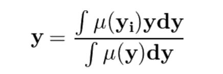
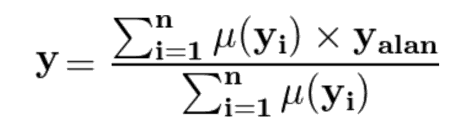
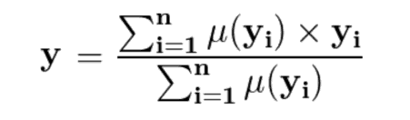

Bulanık mantık, bilgisayarların insanlar gibi kesin kurallar yerine deneyim ve yorumlara dayalı kararlar verebilmesini sağlayan bir yapay zekâ yöntemidir.

Klasik programlamada sonuçlar kesin (doğru/yanlış, evet/hayır) iken, bulanık mantık küme teorisinin genişletilmiş hâlini kullanarak "az", "çok", "biraz", "yaklaşık" gibi belirsiz ifadeleri de değerlendirebilir.

Bu sayede bilgisayarlar, yalnızca kesin kurallara bağlı kalmak yerine verilerden ve deneyimlerden yararlanarak insan benzeri, daha esnek ve sezgisel kararlar verebilir.

Bulanık mantıkta bir karar mekanizması oluşturmak için kural tablosu ve üyelik fonksiyonlarına ihtiyaç duyulur.

➲ Bulanık mantıkta kural tablosu, insan mantığına dayanan EĞER-O ZAMAN (IF-THEN) ifadelerinin bir araya getirilip düzenlendiği, sistemin nasıl karar vereceğini gösteren temel kılavuzdur. Girdi ve çıktı ilişkilerini matris şeklinde düzenler.
➲ Bulanık mantıkta üyelik fonksiyonu, bir elemanın bir kümeye ait olma derecesini [0, 1] arasındaki sayılarla gösteren matematiksel bir yapıdır; üçgen, yamuk ve çan eğrisi gibi çeşitleri bulunur. Klasik mantıktaki kesin "0" veya "1" kuralını esneterek kısmi aidiyet sağlar.

Bulanık mantığın temelini bulanık kümeler oluşturur.
Klasik (keskin/crisp) kümelerde bir eleman bir kümeye ya tam üyedir (1) ya da üye değildir (0). Ara değer yoktur.
Bulanık kümelerde ise bir eleman kümeye kısmen üye olabilir. Üyelik derecesi 0 ile 1 arasında herhangi bir değer alabilir.
Örnek

Bir bardak su için:
Klasik mantık: Bardak ya doludur (1) ya da boştur (0).
Bulanık mantık: Bardak %70 dolu, %30 boş olabilir.

Yani bulanık mantık sadece "evet" veya "hayır" demek yerine, "biraz", "çok", "yaklaşık" gibi ifadeleri de kullanabilir.

En çok kullanılan 5 üyelik fonksiyonu 
‣ Triangular (üçgen)
‣ Trapezodial (çatı)
‣ Singleton (tekil)
‣ Gauss (dalga) 
‣ Piecewise (çok parçalı)

Bulanık kümeler ve bulanık kümelerin üyelik fonksiyonları, bulanık üyelik dereceleri ile oluşturulan kontrol sistemleri bulanık sistemler olarak adlandırılır.

Giriş => Bulanıklaştırma => Çıkarım Birimi <=> Kural Tabanı => Durulaştırma => Çıkış

Dilsel ifadeler arasında işlemler yapma ve dilsel bir karar üretme aşamasına çıkarım yapma denir.

Dilsel tespit, en fazla üyelik değerinin olduğu kümenin adı; sayısal tespit ise elemanın tüm kümelere üyelik değeridir.

Çıkarım yapılabilmesi için kural tabanına -veya kural tablosu- ihtiyaç duyulmaktadır.
Örnek: Radar bir kişiye ceza yapacak ise yalnızca hız verisini kullanmamalıdır. Örneğin yağışlı bir havada fren mesafesi ve sürüş hakimiyeti azalacağından azamı sınırlarını azaltmalı ; düz yollarda ise virajlı yollara göre hız sınırını daha fazla arttırmalıdır.

Bulanık mantıkta kural tablosunu oluşturan bu önermeler IF, THEN yapısında olur. Kural tabanının oluşturulmasının ardından çıkarım yöntemlerinden biri tercih edilmeli ve çıkarım işlemi yapılmalıdır. Literatürde en sık kullanılan çıkarım yöntemleri Mamdani ve Sugeno çıkarımlarıdır.

✔️ Mamdani çıkarımı:

    Bu yöntem temel olarak girişlerin bulanıklaştırılması, kural değerlendirmesi ve durulaştırma adımlarından oluşur. AND bağlacı ile birbirine bağlanan iki parametre (üyelik değeri) arasında en küçük (min) olanı alınırken, OR bağlacı ile büyük (max) olanı alınır.

        Parametreler:

            ‣ [(M)] Toprak Nem Oranı (yüksek - orta - düşük) : Toprağın nem oranı [0-100] tanım aralığında değerler alacaktır. Nem oranının düşük olması sulama ihtiyacını artıracaktır.
            ‣ [(T)] Hava Sıcaklığı (yüksek - orta - düşük) : Hava sıcaklığı [0-40] tanım aralığında değerler alacaktır. Sıcaklığın yüksek olması sulama ihtiyacını artıracaktır.
            ‣ [(R)] Yağış İhtimali (yüksek - orta - düşük) : Yağış ihtimali [0-100] tanım aralığında değerler alacaktır. Yağış ihtimalinin yüksek olması sulama ihtiyacını azaltacaktır.
            ‣ [(P)] Bitki Yaşı (genç - orta - yaşlı) : Bitki yaşı yıl olarak [0-20] tanım aralığında değerler alacaktır. Genç bitkiler daha düzenli sulamaya ihtiyaç duyacaktır.
            ‣ [(O)] Sulama Süresi (uzun - orta - kısa) : M, T, R ve P parametrelerine göre oluşturulmuş kurallar sonucu çıkarımın çıkış kümesi, sulama süresidir.

        Kural Tablosu:

            ⇒ Eğer toprak nemi düşük ve hava sıcaklığı yüksek ise, o halde sulama süresi uzun olmalıdır.
            ⇒ Eğer toprak nemi orta ve hava sıcaklığı orta ise, o halde sulama süresi orta olmalıdır.
            ⇒ Eğer toprak nemi yüksek ve hava sıcaklığı düşük ise, o halde sulama süresi kısa olmalıdır.
            ⇒ Eğer yağış ihtimali yüksek ve bitki yaşı yaşlı ise, o halde sulama süresi kısa olmalıdır.
            ⇒ Eğer yağış ihtimali orta veya bitki yaşı orta ise, o halde sulama süresi orta olmalıdır.
            ⇒ Eğer yağış ihtimali düşük veya bitki yaşı genç ise, o halde sulama süresi uzun olmalıdır.
        
        Örnek Giriş Değerleri:

            ✔ Toprak Nem Oranı = 25
            ✔ Hava Sıcaklığı = 35°C
            ✔ Yağış İhtimali = 20
            ✔ Bitki Yaşı = 3 yıl

        Kural Tabanı:

            ⇒ kural 1 = μMdüşük(25) & μTyüksek(35) => μOuzun
            ⇒ kural 2 = μMorta(25) & μTorta(35) => μOorta
            ⇒ kural 3 = μMyüksek(25) & μTdüşük(35) => μOkısa
            ⇒ kural 4 = μRyüksek(20) & μPyaşlı(3) => μOkısa
            ⇒ kural 5 = μRorta(20) | μPorta(3) => μOorta
            ⇒ kural 6 = μRdüşük(20) | μPgenç(3) => μOuzun

        Cebirsel Kural Tabanı:
            Hatırlayacak olursak & (VE) operatörü ile bağlanan ifadeleri min(), | (VEYA) operatörü ile bağlanan ifadeleri ise max() fonksiyonu ile bağlamamız gerekmektedir. Buna göre cebirsel kural tabanımızı tekrar düzenleyelim.
            ⇒ kural 1 = min( min(μMdüşük(25), μTyüksek(35)), μOuzun )
            ⇒ kural 2 = min( min(μMorta(25), μTorta(35)), μOorta )
            ⇒ kural 3 = min( min(μMyüksek(25), μTdüşük(35)), μOkısa )
            ⇒ kural 4 = min( min(μRyüksek(20), μPyaşlı(3)), μOkısa )
            ⇒ kural 5 = min( max(μRorta(20), μPorta(3)), μOorta )
            ⇒ kural 6 = min( max(μRdüşük(20), μPgenç(3)), μOuzun )

            μPgenç(3) cebirsel ifadesi; 3 yıllık bitki yaşının 0-20 aralığında "genç bitki" kümesine üyelik değeridir. Aynı biçimde μRorta(20) ifadesi ise %20 yağış ihtimalinin "orta yağış" kümesine üyelik değeridir. Ardından bu kuralları çıkışlarına göre ilişkilendirmeliyiz. Örneğin kural 1 ve kural 6, uzun sulama süresine işaret etmektedir. Karara etkisi daha yüksek olan kural seçilmelidir. Dolayısıyla max operatörü yardımı ile tüm kurallar çıkış kümelerine göre bağlandırılmalıdır.

            ⇒ Okısa = max(kural3, kural4)
            ⇒ Oorta = max(kural2, kural5)
            ⇒ Ouzun = max(kural1, kural6)

            ⇒ Bulanık Mamdani Çıkarımı = max(Okısa, Oorta, Ouzun)

✔️ Sugeno çıkarımı:

    Sugeno çıkarımı, özellikle kontrol ve gömülü sistemler alanlarında sıklıkla tercih edilir. Mamdami çıkarımı bulanık bir çıktı verirdi ve bu sonucun rasyonel olarak bir sonuca dönüşmesi için durulaştırma işlemi yapılmalıydı. Buna karşın Sugeno çıkarımında girişler bulanık bir küme, çıkışlar ise bir fonksiyon şeklindedir. Modelde polinomun parametreleri ise giriş değerlerinin bulanık kümelere olan üyelik değerleridir. Bu modelde her bir kural iki değer üretir. Kuralların çıktısı olan (z); zi=aix+biy+ci şeklinde bir polinomdur.

Durulaştırma:
    Bulanık mantık, bulanık değerler üzerinden dilsel ifadeler ile çıkarım yaptığından elde edilen sonuçların rasyonel dünyaya uyarlanabilmesi için durulaştırma tekniklerine ihtiyaç duyulmaktadır. Mamdani çıkarımından elde ettiğimiz sonuçları şu üç durulaştırma işleminden birini kullanarak rasyonel hale getirebiliriz.

    1- Ağırlık Merkezleri

        

        Ağırlık merkezleri ile durulaştırma yapmak için bulanıklaştırılmış değerlerin (üyelik değerlerinin), bulanık çıkış kümeleri üzerinde kestiği alanların toplamı hesaplanır. Bu alanların geometrik ağırlık mezkezleri ise rasyonel ve anlamlı bir çıktıdır.

    2- Ağırlıklı ortalama

        

        Ağırlıklı ortalama ile durulaştırma yapmak yalnızca simetrik grafiğe sahip çıkış kümelerinde uygulanabilir. Her bir kural için olan üyelik değerleri ile bu değerin çıkış kümesi üzerinde kestiği alanın çarpımı her bir üyelik değerinin ağırlıklı ortalamasıdır. Dolayısı ile üyelik değerine göre her birinin çıkışa etkisi de ağıtlık olarak alınmakta ve sonuç bu duruma göre değişmektedir.

    3-Alan Merkezi

        

        Bulanık üyelik değerlerinin çıkış kümeleri üzerinde kestiği lanalarda en büyük üyelik değerini veren çıkış değerleri tespit edilir ve yukarıdaki alan merkezi formülü ile hesaplanır. Burada ağırlıklı ortalama veya ağırlık merkezleri durulaştırma yöntemleri gibi bir alan hesaplaması yapılmamaktadır. Üyelik değerlerinin çıkış kümeleri üzerinde kestiği her alanın kendi içerisinde alan merkezi hesaplanmakta ve bu merkezlerin ortalaması alınmaktadır. Böylelikle anlamlı ve rasyonel bir çıktı elde edilir.

